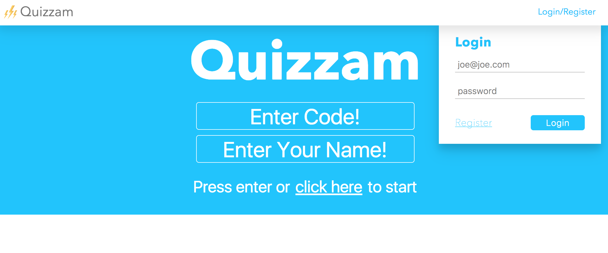
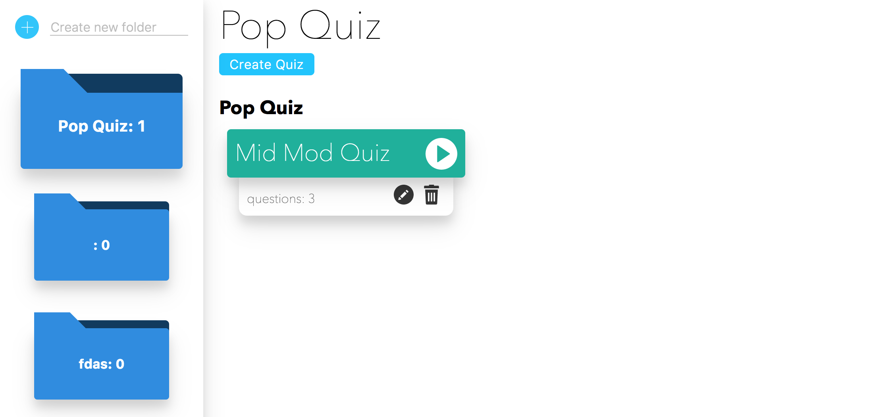
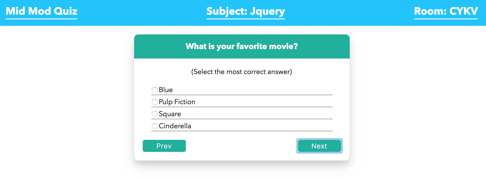
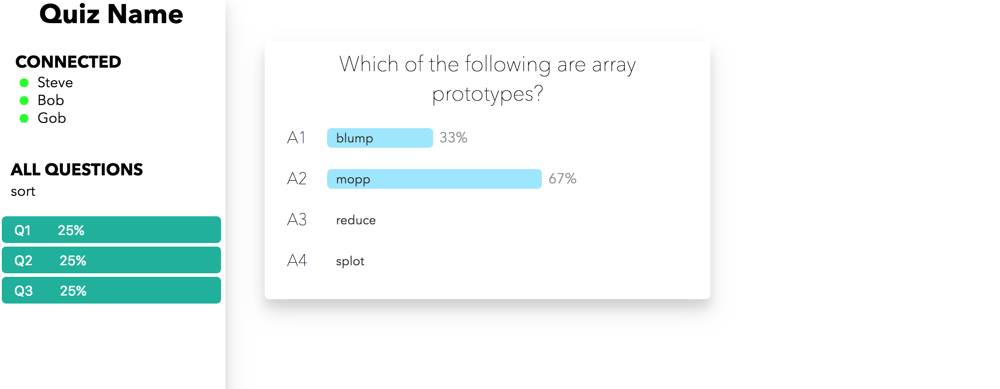

# Quizzam
# Juan, George, Joe, James, Evan
[](https://circleci.com/gh/EvanSays/Quizzam/tree/master)

## Setup

### Database Part 1
#### Pre-reqs
Download Postgresql through Homebrew
```
$ brew install postgres
```
[Alternatively, if you do not have homebrew installed](https://brew.sh/)
#### Getting Started
Start up postgress
```
brew services start POSTGRESQL
```
Create database quizzam_dev
```
$ psql
CREATE DATABASE quizzam_dev;
```
Create database quizzam_test
```
$ psql
CREATE DATABASE quizzam_test;
```
#### Managing databases

To manage quizzam_dev and quizzam_test, we reccomend using [Postico](https://eggerapps.at/postico/).

Alternatively, [here is a psql cheatsheet](https://gist.github.com/Kartones/dd3ff5ec5ea238d4c546).

* Currently, the databases exists without seed data. After the repo is installed in the directions below, we can apply the seed data to the databases we jsut created.

### Respository

#### Pre-reqs
Clone / fork the repo

```
cd quizzam
npm install
```

#### To Start
To start the app, we will need to run the build and server in seperate terminal windows. 

In build window
```
npm run build
```

In server window
```
npm run server
```

#### Browser
In browser open up http://localhost:3000/
* Quizzam should be running without any seed data
* You can now follow the Migrating Database instructions below.

### Database Part 2

#### Migrating Database (Skip this section until after repository is installed)

Knex is included to create the schema for quizzam_dev and quizzam_text. We have also provided initial seed data, for your use.

```
knex migrate:latest
```
```
knex seed:run
```

#### Re-Migrate the database

In some cases after using the app and adding dummy data, we might want to reapply the initial seed data. To do this, we rollback the migration and reaaply with the seed data.

```
knex migrate:rollback
```
```
knex migrate:latest
```
```
knex seed:run
```

## Screenshots

### Home Page


### Quiz List


### Quiz


### Results
